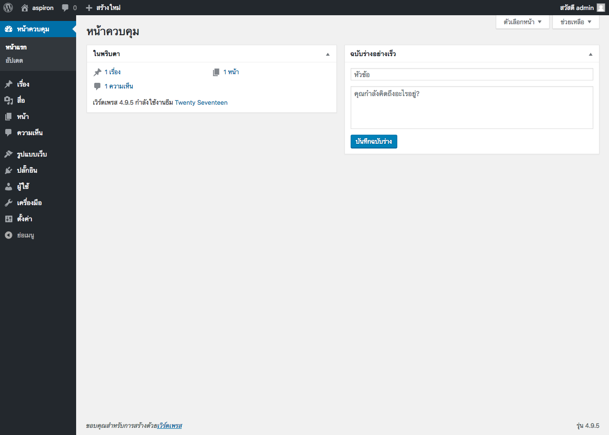

# Docker Compose Wordpress for Developer
This project was generated with [Wordpress](https://github.com/WordPress/WordPress) version 4.9.5th
## Example

### 1. phpMyAdmin demo
- http://localhost:8080
- user: root
- pass: p4ssw0rd

### 2. wordpress demo
- http://localhost

# Features
- wordpress 4.9.5th
- mysql 5.7
- phpMyAdmin
# Run Docker Compose 
### build images
 `$ docker-compose -f docker-compose.yml build --force-rm`
### run 
`$ docker-compose -f docker-compose.yml up`
